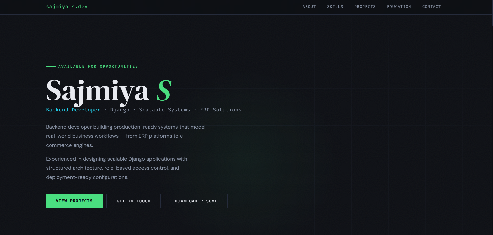
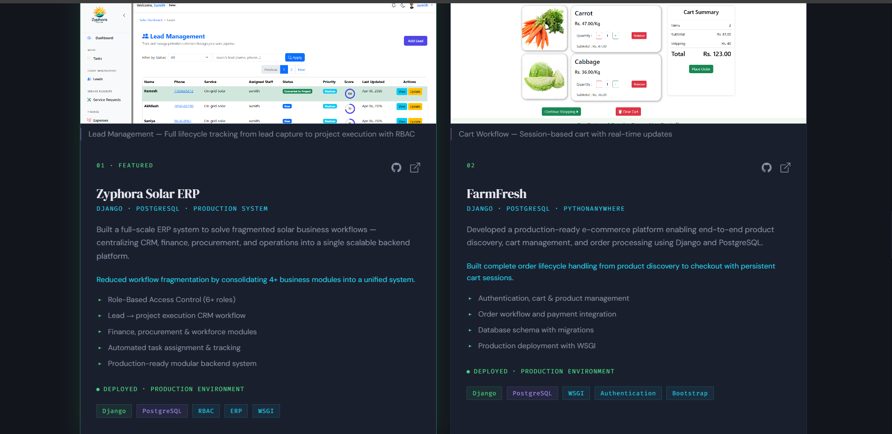

# 💼 Sajmiya S — Portfolio Website

🚀 A fully responsive personal portfolio website showcasing my projects, skills, and experience as a **Backend Developer (Django)**.

---

## 🌐 Live Demo

🔗 https://sajmiya-s.github.io/portfolio-website/

---

## 📌 About the Project

This portfolio website is designed to present my work in a clean and professional way.
It highlights real-world projects, technical skills, and deployment experience.

---

## ✨ Features

* 📱 Fully responsive design (mobile-friendly)
* 🧑‍💻 Project showcase with screenshots
* ⚡ Smooth navigation and clean UI
* 📬 Contact section
* 🌐 Deployed and accessible online

---

## 🛠️ Tech Stack

* HTML5
* CSS3
* Bootstrap
* JavaScript

---

## 📸 Screenshots

### 🏠 Homepage



### 📂 Projects Section



---

## 🚀 Getting Started

To run this project locally:

```bash
git clone https://github.com/Sajmiya-S/portfolio-website.git
cd portfolio-website
open index.html
```

---

## 📁 Folder Structure

```
portfolio-website/
│── index.html
│── index.css
│── index.js
│── resume.pdf
│── images/
```

---

## 🤝 Connect with Me

* 💼 LinkedIn: https://www.linkedin.com/in/sajmiya/
* 💻 GitHub: https://github.com/Sajmiya-S

---

## ⭐ Show Your Support

If you like this project, give it a ⭐ on GitHub!

---


